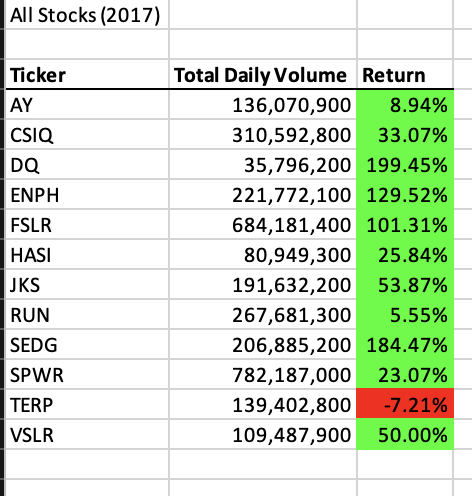
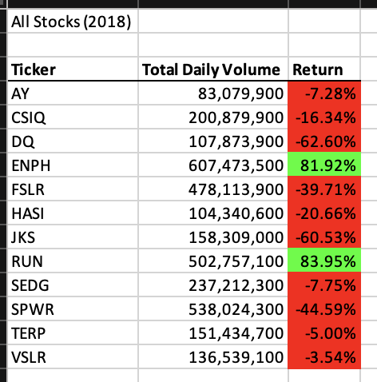
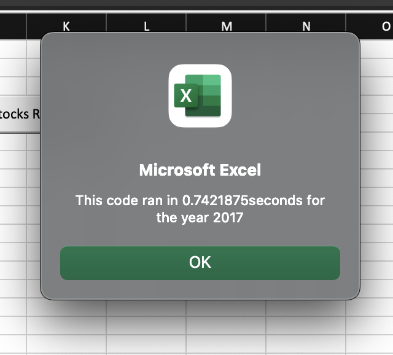
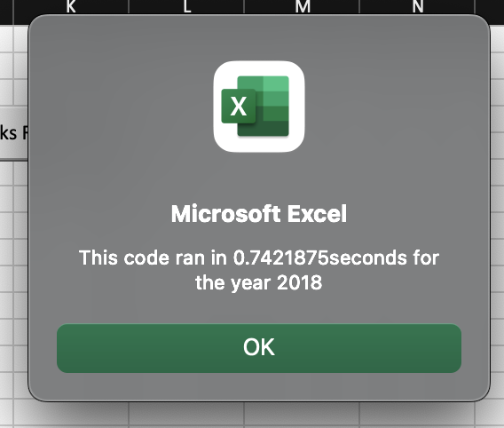
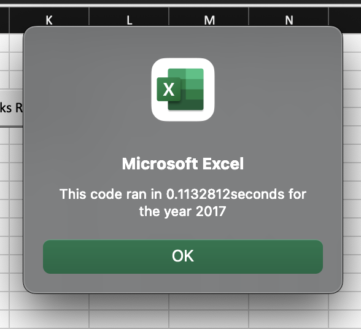
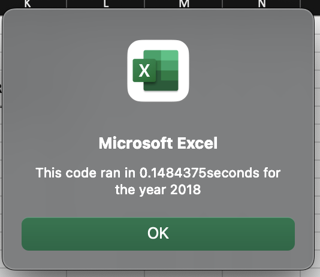

# VBA Stock Challenge Analysis 

## Overview
To create an easy and efficent way using VBA macros to analysis on selecte few stock performance based on the following for the years 2017 and 2018 

- Daily Opening and Closing of Stock Prices 
- Daily High and Lows of Stock Prices 
- Daily Adjusted Close Prices
- Daily Volume Traded 

The purpose is to see if 'DAQO" aka "DQ" is a good investment or is there another stock that will yield a higher return based on 2017 and 2018 data set. 

## Results 
**Stock Performance:**

It appeares that `DQ` had a amazing performance in 2017 with close to 200% increase in volume however it took a 63% decreased in 2018. While on the other hand `ENPH` and `RUN` seems to be the most stable showing increases for both 2017 and 2018. `ENPH` in 2017 increased it's volume by 83% and another 130% in 2018. `RUN` on the other hand shows a little more modorate gains with 6% in 2017 nand 84% in 2018. Both `ENPH` and `RUN` have a higher daily volume then `DQ`. The data shows that it would be a better option to go with `ENPH` which shows more stable positive growth and a higher daily volume.

**Refactor Script and Runtime Execution:**

1. 2017 vs 2018
Year vs year runtime shows that the perfromance of both scripts on similar data set is the relatively the same based on the following observations:

- The run time for 2017 vs 2018 data for the originial script shows the exact same runtime of both data sets.
- The run time for for 2017 vs 2018 data for the refactor script shows that the data set for 2018 took 0.03 longer then 2017. 

2. Original Script vs Refactor Script 2018

It appears there appears to be a huge difference in terms of refactor and the original script. The refactor script is faster by about 0.6 seconds comparaed to the original script. 

*Original Script and Runtime Execution:*

*Refactor Script and Runtime Execution:*

## Summary 
**Advantages of Refactoring Code**
1. The code is way more declarative and readable from a readers standpoint. It is easy ti understand what is happening without refenencing the worksheet in order to try and figure it out. 
2. It may cut down on processing run time. 
3. It helps trim down on repetitive code 
4. It cuts down on size of file and script.
5. It cuts down on length of script.

**Refactoring the original VBA script**
The above appears to be  true for most VBA scrip refactor. Take for example run time from the above analysis it cut down the processing time by .06 seconds for the refactore code and it was so much easier to read after refactor and the length of script did decrease as well. 

